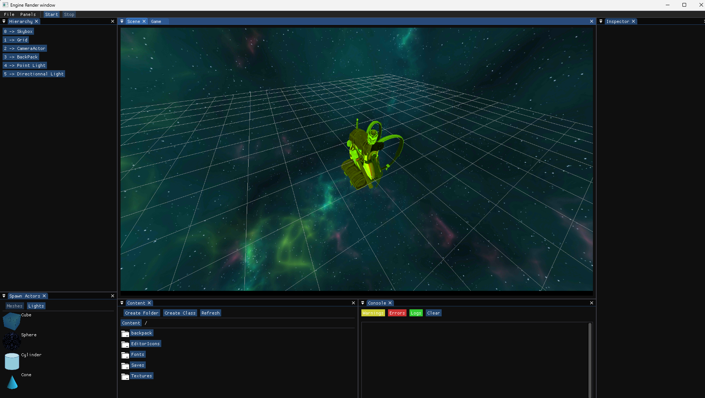
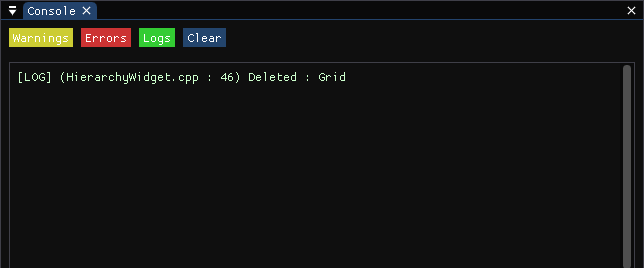
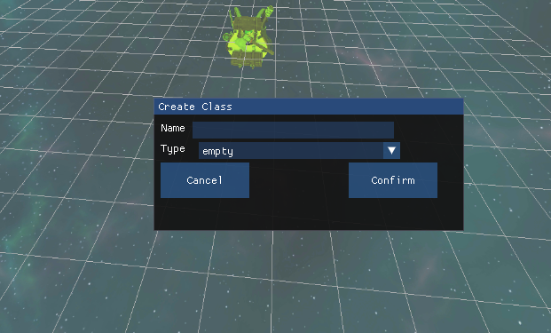
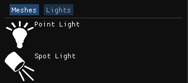
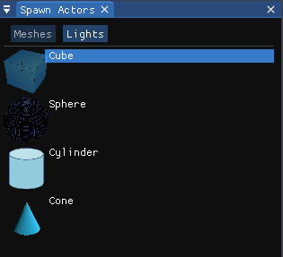
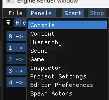

# ⚡ ComUnity ⚙️

ComUnity is a project from Objectif3D where the goal was to make a GameEngine by learning OpenGL.

⚠️ __Made in One Week__

## Teams 👥

<ins>🗂️ Gestion:</ins>
- [@OlivierM98](https://github.com/OlivierM98)
- [@MedyHanne](https://github.com/MedyHanne)
- [@DMystop](https://github.com/DMystop)
- [@Alkonogi](https://github.com/Alkonogi)

<ins>🖥️ UI:</ins>

- [@Kylariria](https://github.com/Kylariria)
- [@Ultired8](https://github.com/Alkonogi)
- [@DamienP1602](https://github.com/DamienP1602)

<ins>💡 Lights:</ins>
- [@RaphBv](https://github.com/RaphBv)
- [@Fuegodavid57](https://github.com/Fuegodavid57)
- [@Harull](https://github.com/Harull)
- [@SilverIkito](https://github.com/SilverIkito)

<ins>⚛️ ReactPhysics:</ins>
- [@Lu0ma](https://github.com/Lu0ma)
- [@J0su4k](https://github.com/J0su4k)
- [@Tranzate](https://github.com/Tranzate)

<ins>🔊 Sound:</ins>
- [@Lefleur05](https://github.com/Lefleur05)

__🎓 Supervised by [@ThreatsHunterPro](https://github.com/ThreatsHunterPro), our teacher.__

## Images 🖼️

<ins>Console:</ins>

<ins>Create Class:</ins>

<ins>Editor Preferences:</ins>

<ins>Light Panel:</ins>

<ins>Mesh Panel:</ins>

<ins>Panels:</ins>

